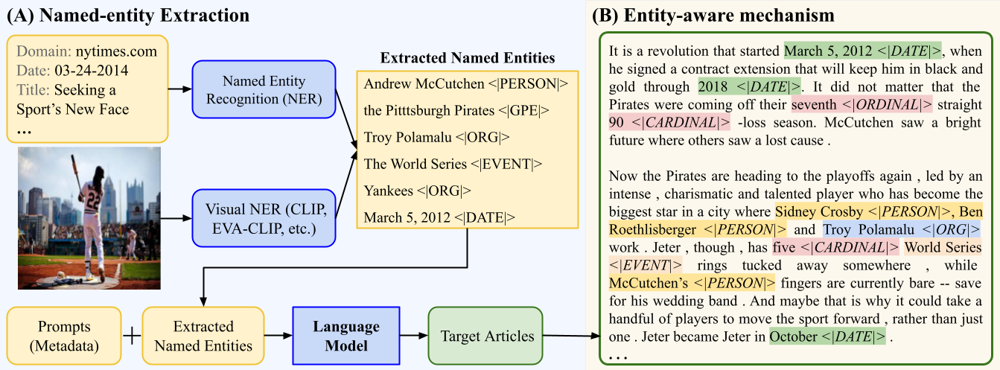

# Show, Write, and Retrieve: Entity-aware Article Generation and Retrieval


**ENGINE** is an entity-aware model for article generation and retrieval. This repository contains the implementation of our [paper](https://arxiv.org/pdf/2112.05917.pdf).
If you find this code useful in your research, please consider citing:

    @InProceedings{ZhangENGIN2023,
         author={Zhongping Zhang and Yiwen Gu and Bryan A. Plummer},
         title={Show, Write, and Retrieve: Entity-aware Article Generation and Retrieval},
         booktitle={Findings of the Association for Computational Linguistics: EMNLP 2020},
         year={2023}}



## Setting up the environment

The requirements for **ENGINE** can be installed by

```pip
pip install -r requirements.txt
```

The *PyTorch* library is installed on *CUDA* 11.1 platform and the *Python* version is 3.8.8.

If you have multiple projects to address in a single machine, you might need to create an independent *Anaconda* environment for **ENGINE** 

```pip
conda create -n engine python=3.8.8 &&
conda activate engine && 
pip install -r requirements.txt
```


*Note*: If you would like to implement the Clip-based NER in our paper, you will need to set up the [CLIP](https://github.com/openai/CLIP) environment by 

```pip
pip install -r requirements_clip.txt
```


## Datasets:
We performed our experiments on three datasets, GoodNews, VisualNews, and WikiText. We provided the versions we employed for model training and evaluation through the following links. Compared to the original version, we removed broken links and non-English articles.

| Datasets           | Google Drive Link                                                                                     |
|--------------------|-------------------------------------------------------------------------------------------------------|
| GoodNews           | [GoodNews Link](https://drive.google.com/drive/folders/1sh4m6psBkvDXZkqtPpPOPv2L4ANXO-dY?usp=sharing) |
| VisualNews         | [VisualNews Link](https://drive.google.com/drive/folders/1GTSphR4Xw1kmy8Do9S-oytQBvx-xv-En?usp=sharing)|
| WikiText           | [WikiText Link](https://drive.google.com/drive/folders/1l6eJRo0vh9ReVGedowXPCeIIG-KbAxXv?usp=sharing) |


If you would like to obtain the original data, please consider collect the data from their official websites:
[GoodNews](https://github.com/furkanbiten/GoodNews) & [VisualNews](https://github.com/FuxiaoLiu/VisualNews-Repository) & [WikiText](https://arxiv.org/abs/1609.07843)

## Train & Evaluate the ENGINE model
### Train and Evaluate PPL
Run the following script to finetune and evaluate GPT2:
```sh
cd code &
sh scripts/run_train_gpt2_goodnews.sh & 
sh scripts/run_eval_gpt2_goodnews.sh
```
Run the following script to finetune and evaluate ENGINE:
```sh
sh scripts/run_train_gpt2_goodnwes_NEboth_wcap.sh & 
sh scripts/run_eval_gpt2_goodnews_NEboth_wcap.sh
```

### Article Generation
Run the following script to generate articles.
```sh
sh scripts/EXP1_NEboth_art_gen_goodnews.sh
```

### Experiments on VisualNews
Experiments on VisualNews can be performed by simply modifying the file paths in our goodnews scripts.


## Models Weights
Download ENGINE weights in this [http URL](https://drive.google.com/drive/folders/1I_igVP0oxdo0gQlFEHAzznG2Ion3EIaa?usp=sharing).


